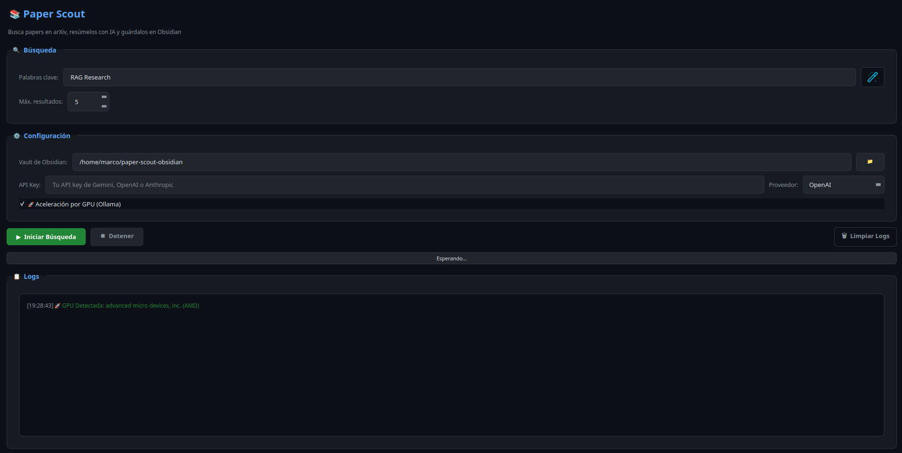

# 📚 Paper Scout — Tu Smart Research Assistant


**Paper Scout** es una aplicación de escritorio *premium* diseñada para Linux que transforma la forma en que investigas. Utiliza Inteligencia Artificial para buscar papers en **arXiv**, resumirlos de forma inteligente y organizarlos automáticamente en tu **Vault de Obsidian**.



---

## ✨ Características Principales

### 🔍 Búsqueda de Precisión
- **Búsqueda por Frases**: Usa comas para buscar términos exactos (ej: `deep learning, transformer`).
- **✨ Búsqueda Mágica**: Describe tu tema en lenguaje natural y deja que la IA genere las palabras clave técnicas por ti.

### 🤖 Motor de IA Multi-Proveedor
Soporte nativo para los mejores modelos del mercado:
- **Cloud**: OpenAI (GPT-4o), Gemini (2.0 Flash) y **Claude (3.5 Sonnet)**.
- **Local**: Integración total con **Ollama** (Llama 3.2, Phi-3, etc.) para total privacidad y coste cero.

### 🚀 Aceleración por Hardware
- **Detección Automática de GPU**: Optimizado para GPUs **NVIDIA** y **AMD**.
- **Offloading Inteligente**: Configuración automática de capas en VRAM para que la inferencia local sea instantánea.

### 📓 Integración con Obsidian
- **Notas Estructuradas**: Genera archivos `.md` con resúmenes en español.
- **Metadata en YAML**: Frontmatter optimizado para el plugin **Dataview**.
- **Tags Inteligentes**: Mapeo automático de categorías de arXiv a tags legibles.

---

## 🚀 Instalación y Configuración

### 1. Requisitos Previos
Asegúrate de tener Python 3.10+ y, opcionalmente, Ollama instalado si prefieres inferencia local.

### 2. Configuración del Entorno
```bash
# Clonar y entrar al proyecto
git clone https://github.com/marquito3012/paper-scout.git
cd paper-scout

# Crear entorno virtual e instalar dependencias
python3 -m venv .venv
source .venv/bin/activate
pip install -r requirements.txt
```

### 3. Integración en el Sistema (Recomendado) 👔
Para no tener que usar la terminal, instala Paper Scout como una aplicación nativa de tu escritorio:
```bash
chmod +x install_app.sh
./install_app.sh
```
*Ahora podrás encontrar "Paper Scout" en tu menú de aplicaciones con su icono oficial.*

---

## 🎮 Guía de Uso

1. **Inicia la App**: Úsala desde el menú de aplicaciones o con `python main.py`.
2. **Configura tu IA**: 
   - Selecciona el proveedor (Gemini, Claude, OpenAI u Ollama).
   - Si usas Cloud, pega tu **API Key**.
   - Si usas Ollama, activa la **🚀 Aceleración por GPU**.
3. **Describe tu Tema**: Pulsa el icono ✨, describe lo que buscas y acepta las palabras clave generadas.
4. **Define tu Vault**: Selecciona la carpeta donde guardas tus notas de Obsidian.
5. **▶ Iniciar**: La App trabajará en segundo plano sin bloquear la interfaz. Recibirás una notificación al terminar.

---

## 📊 Formato de Metadatos (Dataview Ready)

Cada nota generada incluye este bloque YAML:
```yaml
---
title: "Attention Is All You Need"
authors: [Vaswani, Ashish, et al.]
tags: [paper, machine-learning, nlp]
date: 2017-06-12
arxiv_id: "1706.03762"
url: "https://arxiv.org/abs/1706.03762"
pdf_url: "https://arxiv.org/pdf/1706.03762"
categories: [cs.CL, cs.LG]
status: unread
created: 2026-03-28
---
```

---

## 🛠️ Arquitectura Técnica
- **GUI**: PyQt6 con sistema de temas QSS Dark.
- **Async**: Patrón *Worker Object* para evitar el bloqueo del hilo principal (GUI) durante la inferencia y búsqueda.
- **Modelos**: Abstracción de proveedores LLM mediante el motor `LLMSummarizer`.
- **Hardware**: Utilidades de detección de hardware vía `subprocess` y `lspci`.

---

## 📄 Licencia
© 2026 Paper Scout Team — MIT License.
Hecho con 💡 para investigadores.
